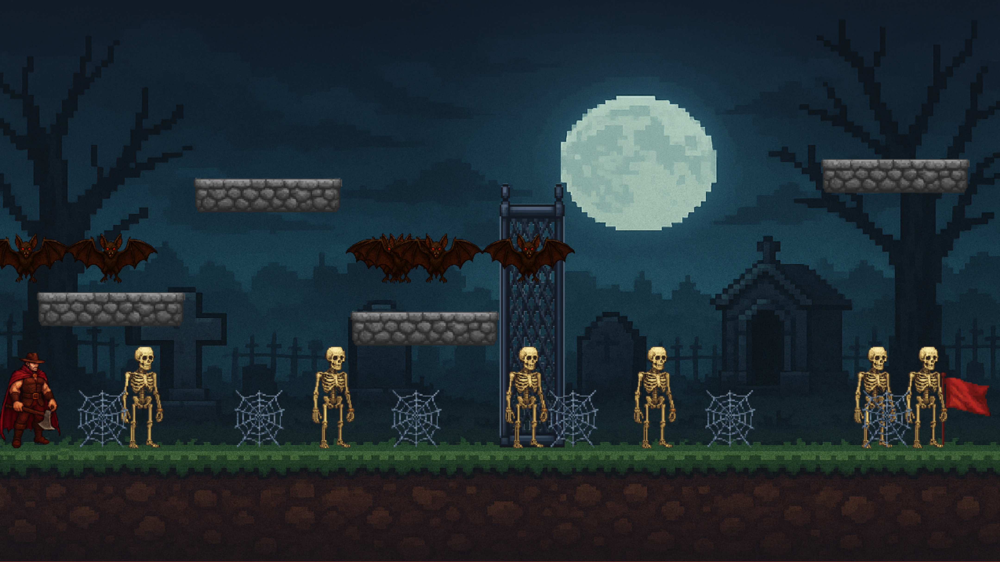
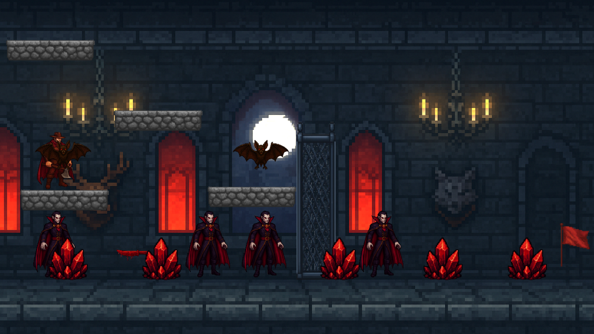
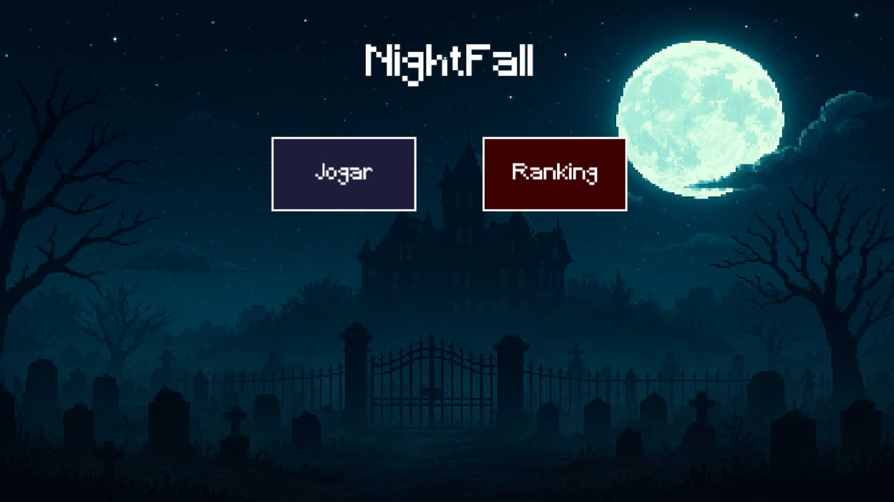
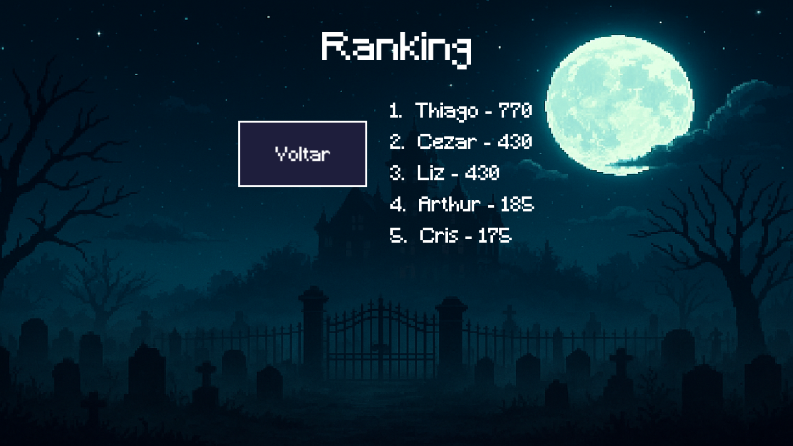
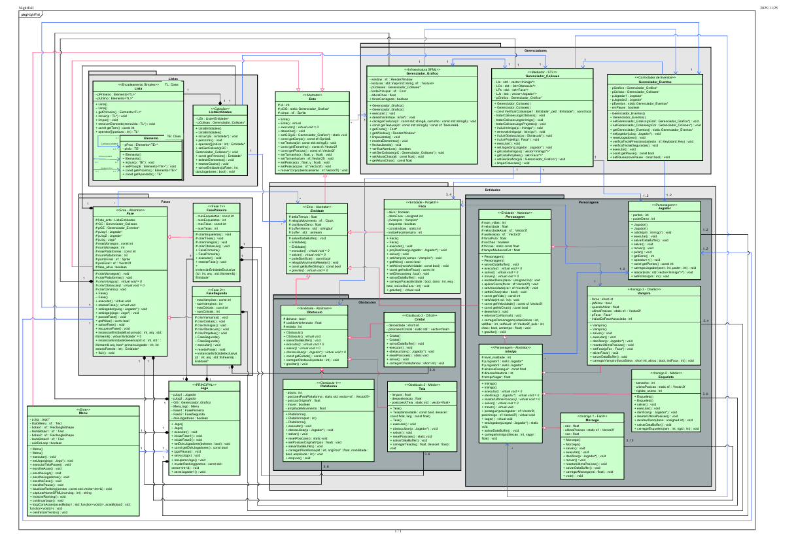

# 🗡️ NightFall

NightFall é um jogo de plataforma 2D em C++ desenvolvido com a biblioteca gráfica SFML 2.6.2 para a disciplina de Técnicas de Programação (UTFPR - Campus Curitiba). O projeto foi construído do zero aplicando os pilares da Programação Orientada a Objetos (POO), padrões de projeto arquiteturais, gerenciamento manual de memória e persistência de dados.

---

## 🎮 Sobre o Jogo

Em NightFall, o usuário controla caçadores que avançam por cenários hostis repletos de perigos até atingirem a bandeira no final de cada nível. O jogo conta com um modo single-player ou cooperativo local simultâneo para dois jogadores, estruturado em duas fases temáticas:

1. Fase 1 (O Cemitério): Os jogadores enfrentam ondas de Esqueletos e Morcegos, ultrapassam o obstáculo desacelerador de Teias e navegam por plataformas para transpor uma grande parede central.
2. Fase 2 (O Castelo): Ambientada no interior de um castelo, onde os jogadores enfrentam Morcegos e o chefão Vampiro (capaz de arremessar facas de sangue), desviando de Cristais móveis que causam dano ao contato.

<div align="center">

<table>
  <tr>
    <td align="center">
      <br>
      <b>Fase 1: O Cemitério</b>
    </td>
    <td align="center">
      <br>
      <b>Fase 2: O Castelo</b>
    </td>
  </tr>
</table>

</div>

---

## 🕹️ Controles do Jogo

| Ação | Jogador 1 | Jogador 2 |
| :--- | :---: | :---: |
| Mover para Esquerda | A | Seta Esquerda |
| Mover para Direita | D | Seta Direita |
| Pular | W | Seta Cima |
| Atacar (Área/Raio) | F | Seta Baixo |

* Pausar / Menu de Pausa: Pressione Esc durante a partida.
* Voltar ao Menu Principal: Pressione M na tela de pausa.

---

## 🚀 Funcionalidades e Menus

* Multiplayer Local Simultâneo: Suporte configurável para 1 ou 2 jogadores na mesma tela.
* Mecânicas de Inimigos: Algoritmos de movimento aleatório, perseguição por raio de proximidade e projéteis (facas arremessadas pelo Vampiro).
* Física e Colisões: Sistema próprio de gravidade, forças de atrito, equações de movimento, operações vetoriais de colisão e variação senoidal em plataformas.
* Persistência de Dados (Save/Load): Salvamento e carregamento completo do estado do jogo via arquivo, além do registro do histórico de pontuação (Ranking com top 5).
* Geração Aleatória: Instanciação aleatória do número e posicionamento de entidades (inimigos e obstáculos) no início das fases.

<div align="center">

<table>
  <tr>
    <td align="center">
      <br>
      <b>Fase 1: O Cemitério</b>
    </td>
    <td align="center">
      <br>
      <b>Fase 2: O Castelo</b>
    </td>
  </tr>
</table>

</div>

---

## 🛠️ Tecnologias Utilizadas

* Linguagem: C++ (Padrão moderno)
* Biblioteca Gráfica & Áudio: SFML 2.6.2
* Ambiente de Desenvolvimento: Visual Studio (MSVC)
* Modelagem: Diagrama de Classes UML (Astah)

---

## 📐 Arquitetura de Código e Padrões (UML)

A estrutura do projeto adota namespaces bem delimitados para garantir alta coesão e baixo acoplamento:

* Ente: Classe base abstrata para todos os elementos visíveis na tela que possuem representação via sf::Sprite.
* Gerenciadores:
  * Gerenciador_Grafico: Centraliza o carregamento de texturas via std::map e renderização de janelas.
  * Gerenciador_Colisoes: Trata interseções e física vetorial entre jogadores, inimigos, projéteis e obstáculos.
  * Gerenciador_Eventos: Implementa o padrão Singleton para capturar comandos e teclas de atalho.
* Fase (FasePrimeira e FaseSegunda): Controlam o ciclo de vida da partida, instanciação de elementos e fluxo de progresso.
* Listas (Lista, Elemento, ListaEntidades): Estruturas encadeadas genéricas (Templates) e organizadores customizados para iterar e atualizar as entidades de forma desacoplada.
* Entidades (Personagens e Obstaculos): Hierarquia polimórfica que inclui Jogador, Esqueleto, Morcego, Vampiro, Plataforma, Teia, Cristal e Faca.

<div align="center">
  <a href="Assets/diagrama_nightfall_definitivo.pdf">
    <br>
    <sub>📄 Clique na imagem para abrir o PDF completo do Diagrama de Classes UML</sub>
  </a>
</div>

---

## 💻 Como Executar o Projeto

### Pré-requisitos
* Compilador C++17 ou superior (MSVC / GCC)
* SFML 2.6.2 configurada na sua IDE / variáveis do sistema

### Passo a Passo
1. Clone este repositório:
   ```bash
   git clone [https://github.com/Felipe-Silvy/NightFall.git](https://github.com/Felipe-Silvy/NightFall.git)
